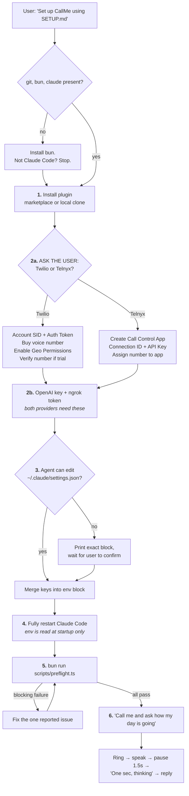

# SETUP.md — agent-executable install guide for CallMe

This file is written for an **AI coding agent** (Claude Code, or any LLM with shell and
file access) to execute end to end. A human should be able to say:

> "Set up CallMe using the SETUP.md in this repo."

…and get a working phone-call integration without reading anything else.

If you are a human: you can follow this too, but the README quickstart is friendlier.

---

## The whole flow at a glance



Every step before the preflight is free. No phone call is placed, and no money is spent,
until the preflight passes.

---

## Rules for the agent

Follow these or you will waste the user's money on failed calls.

1. **Never invent a credential.** If you do not have a value, ask the user for it and give
   them the acquisition steps from Step 2. Do not put placeholders in a real config file.
2. **Never print the user's secrets back to them** in full, and never write them into a
   file that is inside a git repository. They belong in `~/.claude/settings.json` only.
3. **Run the preflight (Step 5) before placing any call.** Each failed call costs real
   money and rings a real phone.
4. **Do the whole flow.** If you cannot complete a step yourself (for example you lack
   permission to edit `settings.json`), print exact copy-paste instructions for the user
   and wait — do not silently skip it and continue.
5. **Ask for all missing credentials in one message**, not one at a time.
6. **Ask which phone provider they use before asking for anything else** (Step 2a). The two
   providers need different accounts and, confusingly, reuse the same variable names for
   different values. Guessing here produces credentials that look right and fail at call
   time.

---

## Step 1 — Install the plugin

Check prerequisites first:

```bash
git --version && bun --version && claude --version
```

If `bun` is missing, install it (`curl -fsSL https://bun.sh/install | bash`) — the MCP
server runs on Bun. If `claude` is missing, the user is not on Claude Code; stop and tell
them this plugin is Claude Code specific.

### Path A — install from a plugin marketplace (preferred)

Tell the user to run these in their Claude Code session (you cannot run slash commands for
them):

```
/plugin marketplace add <owner>/call-me
/plugin install callme@callme
```

Replace `<owner>` with whichever GitHub account hosts the repo.

### Path B — install from a local clone

Use this when the user wants to modify the code, or is offline.

```bash
git clone https://github.com/<owner>/call-me.git ~/call-me
cd ~/call-me/server && bun install
```

Then register the MCP server directly by adding this to `~/.claude/settings.json` under a
top-level `"mcpServers"` key (merge, do not overwrite the file):

```json
"mcpServers": {
  "callme": {
    "command": "bun",
    "args": ["run", "--cwd", "/absolute/path/to/call-me/server", "start"]
  }
}
```

Use an **absolute** path — `~` is not expanded here.

---

## Step 2a — Ask which phone provider they use

**Ask this before requesting any credentials.** Put it to the user plainly:

> CallMe places the actual phone call through either **Twilio** or **Telnyx**. Which do you
> have an account with? If you have neither and don't mind, pick Twilio — it's the more
> common choice and easier to sign up for. Telnyx is roughly 30–50% cheaper per minute if
> you plan to talk a lot.

Do not assume. The code defaults to `telnyx` while most users assume Twilio, and the two
providers **reuse the same variable names for completely different values**:

| Variable | If Twilio | If Telnyx |
|---|---|---|
| `CALLME_PHONE_ACCOUNT_SID` | Account SID (`AC…`) | **Connection ID** of a Call Control App |
| `CALLME_PHONE_AUTH_TOKEN` | Auth Token | **API Key** (`KEY…`) |

Credentials from the wrong provider therefore look perfectly valid and fail only when a
call is attempted. Once they answer, set `CALLME_PHONE_PROVIDER` to `twilio` or `telnyx`
yourself and follow only that provider's section below.

## Step 2 — Collect credentials

You need seven values. Ask for all the missing ones in a single message, including the
acquisition steps below so the user does not have to go hunting.

| Variable | What it is |
|---|---|
| `CALLME_PHONE_PROVIDER` | `twilio` or `telnyx` — from Step 2a |
| `CALLME_PHONE_ACCOUNT_SID` | Twilio Account SID, **or** Telnyx Connection ID |
| `CALLME_PHONE_AUTH_TOKEN` | Twilio Auth Token, **or** Telnyx API Key |
| `CALLME_PHONE_NUMBER` | The number that calls *out* |
| `CALLME_USER_PHONE_NUMBER` | The user's own phone, which will ring |
| `CALLME_OPENAI_API_KEY` | OpenAI key, for speech-to-text and text-to-speech |
| `CALLME_NGROK_AUTHTOKEN` | ngrok token, to expose the local server to the provider |

> `CALLME_PHONE_PROVIDER` is not optional in practice. The code defaults to `telnyx`, and
> the plugin manifest supplies no default, so omitting it silently breaks a Twilio setup
> with a confusing error. Always set it explicitly.

Both phone numbers must be **E.164**: a `+`, country code, then digits, no spaces or
dashes. `+14155551234`, `+2348035700479`.

OpenAI and ngrok are required for **both** providers — they handle speech and the public
tunnel, not the call itself.

### Getting Twilio credentials

1. Sign up at <https://www.twilio.com/try-twilio> and verify your email and phone.
2. The **Account SID** and **Auth Token** are on the Console dashboard at
   <https://console.twilio.com>. Click "show" to reveal the token.
3. Buy a voice-capable number: **Phone Numbers → Manage → Buy a number**, tick the
   **Voice** capability, and purchase. That number is `CALLME_PHONE_NUMBER`.
4. **Enable the destination country.** Voice → Settings → **Geo Permissions**
   (<https://console.twilio.com/us1/develop/voice/settings/geo-permissions>). Tick the
   country of `CALLME_USER_PHONE_NUMBER`. Many countries are off by default and calls fail
   without a useful error.
5. **If the account is on trial** (the preflight will tell you):
   - Verify the destination number under Phone Numbers → Manage → **Verified Caller IDs**,
     or Twilio refuses to call it.
   - Every call opens with a "press any key to execute your code" prompt. That is Twilio,
     not this plugin. Upgrading removes it.

### Getting Telnyx credentials

Skip this if the user chose Twilio.

1. Sign up at <https://telnyx.com/sign-up> and complete verification. Telnyx reviews new
   accounts before allowing outbound calls — this can take a little time, so start here.
2. Create a **Call Control Application**: Voice → **Call Control** → Create Application
   (<https://portal.telnyx.com/#/app/call-control/applications>). Give it any name; the
   webhook URL is set per-call by CallMe, so leave it blank.
3. Copy that application's **Connection ID** — this goes in `CALLME_PHONE_ACCOUNT_SID`.
   It is a numeric ID, *not* a Twilio-style `AC…` string.
4. Create an **API Key** under API Keys (<https://portal.telnyx.com/#/app/api-keys>). It
   starts with `KEY…` and goes in `CALLME_PHONE_AUTH_TOKEN`.
5. Buy a voice-capable number under Numbers → Search & Buy, and **assign it to the Call
   Control Application** from step 2. An unassigned number will not place calls.
6. Recommended: copy the **Public Key** from the API Keys page into
   `CALLME_TELNYX_PUBLIC_KEY`. Without it the server logs a warning and skips webhook
   signature verification, meaning anyone who finds your tunnel URL could drive it.

### Getting an OpenAI API key

1. Create a key at <https://platform.openai.com/api-keys>.
2. The account must have **credit or an active billing method** — the Realtime API is not
   covered by a free tier, and a zero-balance account fails at the first spoken word.
3. No special opt-in is needed for the Realtime API, but the preflight verifies real access
   rather than assuming.

### Getting an ngrok authtoken

1. Sign up at <https://dashboard.ngrok.com/signup>.
2. Copy the token from <https://dashboard.ngrok.com/get-started/your-authtoken>.
3. **The free plan allows 3 simultaneous tunnels.** Each Claude Code session starts its own
   CallMe server with its own tunnel, so a 4th session fails with `ERR_NGROK_108`. Tell the
   user to keep concurrent sessions below the limit or upgrade.

---

## Step 3 — Write the configuration

All variables go in the `"env"` block of **`~/.claude/settings.json`**. The Claude Code CLI
loads that block into its own environment at startup, and the MCP server inherits it.

**Merge into the existing file — do not overwrite it.** Read it first, add only the missing
keys, and preserve everything else. If the file does not exist, create it with just `env`.

```json
{
  "env": {
    "CALLME_PHONE_PROVIDER": "twilio",
    "CALLME_PHONE_ACCOUNT_SID": "ACxxxxxxxxxxxxxxxxxxxxxxxxxxxxxxxx",
    "CALLME_PHONE_AUTH_TOKEN": "your_auth_token",
    "CALLME_PHONE_NUMBER": "+15551234567",
    "CALLME_USER_PHONE_NUMBER": "+15559876543",
    "CALLME_OPENAI_API_KEY": "sk-proj-...",
    "CALLME_NGROK_AUTHTOKEN": "your_ngrok_token",
    "CALLME_TTS_VOICE": "onyx"
  }
}
```

Validate your edit before moving on:

```bash
python3 -c "import json;json.load(open('$HOME/.claude/settings.json'));print('settings.json is valid JSON')"
```

### If you cannot edit `settings.json`

Do not skip this step. Print the block above with the user's real values filled in, and
tell them verbatim:

> Open `~/.claude/settings.json`, find the top-level `"env"` object (create it if it is not
> there), add these keys inside it, save, and then fully quit and reopen Claude Code.

Then wait for them to confirm before continuing.

---

## Step 4 — Restart Claude Code

**This is mandatory and is the most commonly missed step.** `settings.json` `env` is read
once at CLI startup. Editing it while Claude Code is running has no effect on the already
running MCP server — the values will appear correct in the file while the server keeps
using the old ones.

Tell the user to fully quit Claude Code (not just close the tab) and reopen it.

---

## Step 5 — Preflight

Validate every credential against the live services before spending a call:

```bash
cd <repo>/server && bun run scripts/preflight.ts
```

If installed as a plugin rather than a clone, the server lives at
`~/.claude/plugins/cache/callme/callme/<version>/server`.

The script checks that required variables are present and well-formed, that the Twilio
credentials work and the from-number is owned and voice-capable, that an OpenAI Realtime
transcription session is actually accepted, and that an ngrok tunnel can be established. It
exits non-zero on anything blocking.

A trial-account finding is reported but does **not** block — trial accounts work, they just
add the "press any key" gate.

---

## Step 6 — First call

Ask Claude to call: *"Call me and ask how my day is going."*

What a healthy call sounds like:

1. Your phone rings. (Trial accounts: press any key at the prompt.)
2. Claude speaks its opening line.
3. You speak, then **stop talking**. After ~1.5s of silence your turn ends.
4. You hear **"One sec, thinking"** — confirmation your words were transcribed.
5. A pause of roughly 5–20 seconds while the model composes a reply. This is normal.
6. Claude answers.

Two things to tell the user up front, because both look like bugs and are not:

- **The pause at step 5 is expected.** The transcript returns to the model as a tool result
  and the reply costs a full round-trip.
- **Anything said during that pause is discarded.** The server only listens between turns.
  Repeating yourself into the gap does nothing; wait for the reply.

---

## Troubleshooting

| Symptom | Cause | Fix |
|---|---|---|
| You talk, nothing ever comes back | Speech-to-text never connected. Old versions send the retired `OpenAI-Beta: realtime=v1` header and get closed with `beta_api_shape_disabled` | Upgrade to 1.0.4+ |
| "An application error has occurred" | Twilio could not fetch TwiML. Check <https://console.twilio.com/us1/monitor/logs/errors> for an `11200` | A `401 Invalid signature` means an ngrok host the code did not whitelist — 1.0.4+ accepts both `.ngrok-free.dev` and `.ngrok-free.app` |
| `ERR_NGROK_108` / call tools report no tunnel | More than 3 ngrok tunnels; every Claude session starts one | Ask the user whether to close the other sessions themselves or let you run `close_other_callme_sessions`. To keep a session but free its slot, run `/plugin` there and disable CallMe |
| Call rings, is never answered, times out | Nobody picked up within `CALLME_CONNECT_TIMEOUT_MS` (60s) | Answer faster, or raise it |
| Cut off mid-sentence | Turn ends after `CALLME_STT_SILENCE_DURATION_MS` (1500ms) | Raise to 2000–2500 |
| Calls fail to one country only | Twilio Geo Permissions | Enable that country |
| Trial account will not call a number | Number not verified | Add it under Verified Caller IDs |
| Config edits appear to do nothing | `settings.json` env is read at CLI startup | Fully restart Claude Code |
| `21626 invalid statusCallbackEvents` in Twilio logs | Known upstream cosmetic bug | Ignore it |

---

## All environment variables

**Required:** `CALLME_PHONE_PROVIDER`, `CALLME_PHONE_ACCOUNT_SID`, `CALLME_PHONE_AUTH_TOKEN`,
`CALLME_PHONE_NUMBER`, `CALLME_USER_PHONE_NUMBER`, `CALLME_OPENAI_API_KEY`,
`CALLME_NGROK_AUTHTOKEN`

| Optional | Default | Purpose |
|---|---|---|
| `CALLME_ACK_MESSAGE` | `One sec, thinking.` | Spoken when your speech is transcribed. Empty disables it |
| `CALLME_STT_SILENCE_DURATION_MS` | `1500` | Silence that ends your turn |
| `CALLME_CONNECT_TIMEOUT_MS` | `60000` | Wait for answer + media stream |
| `CALLME_TRANSCRIPT_TIMEOUT_MS` | `180000` | Wait for you to say something |
| `CALLME_TTS_VOICE` | `onyx` | OpenAI voice |
| `CALLME_TTS_PROVIDER` | `openai` | `openai` or `kokoro` |
| `CALLME_KOKORO_URL` | — | Kokoro endpoint, if used |
| `CALLME_STT_MODEL` | `gpt-4o-transcribe` | Transcription model |
| `CALLME_PORT` | `0` (random) | Local webhook port |
| `CALLME_NGROK_DOMAIN` | — | Custom ngrok domain (paid) |
| `CALLME_TELNYX_PUBLIC_KEY` | — | Telnyx webhook verification |
